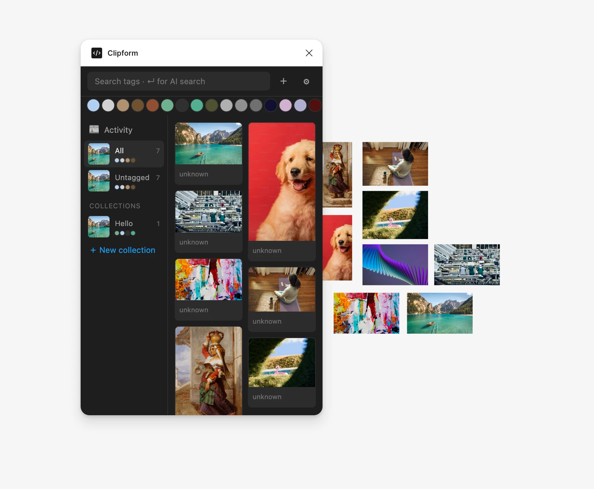
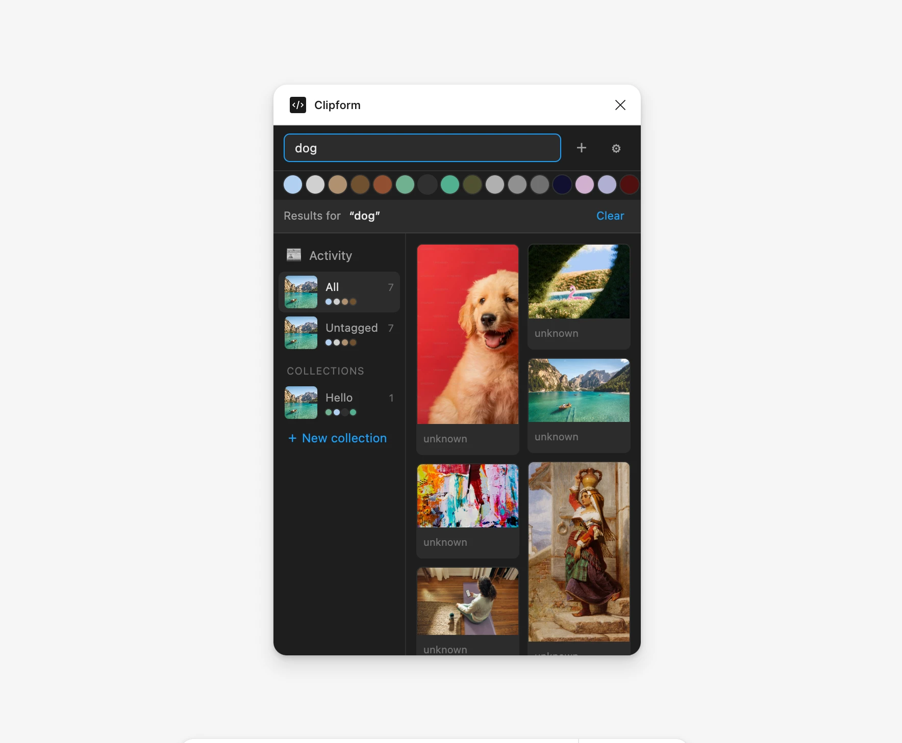
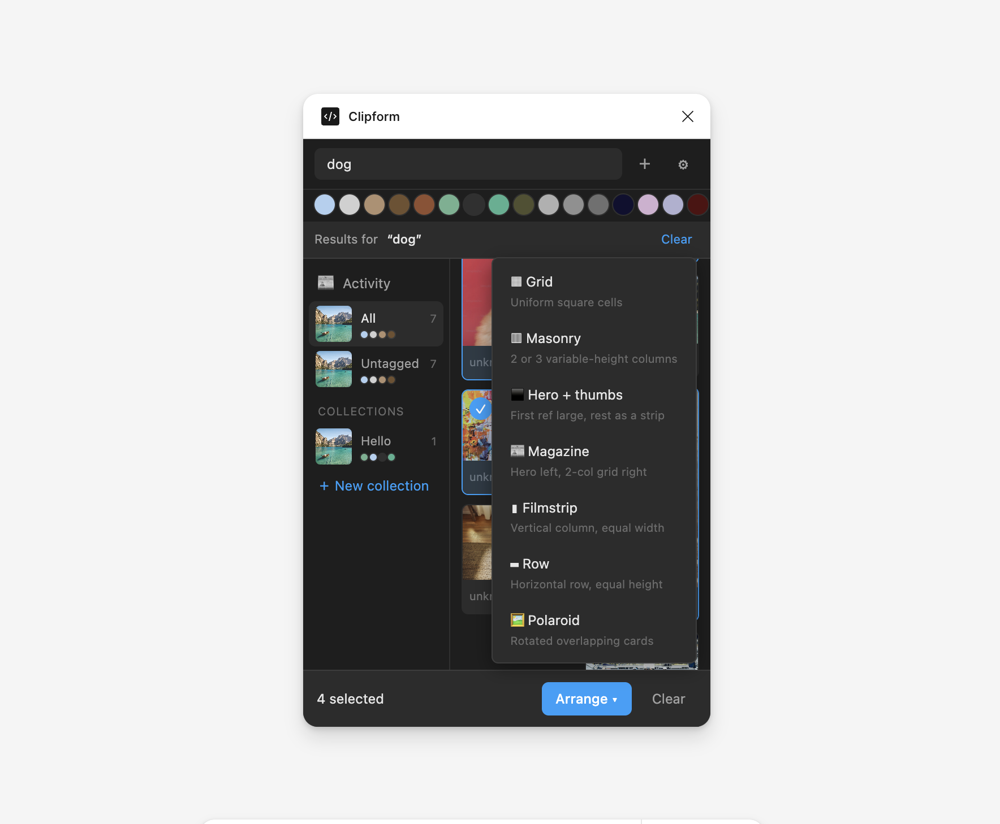
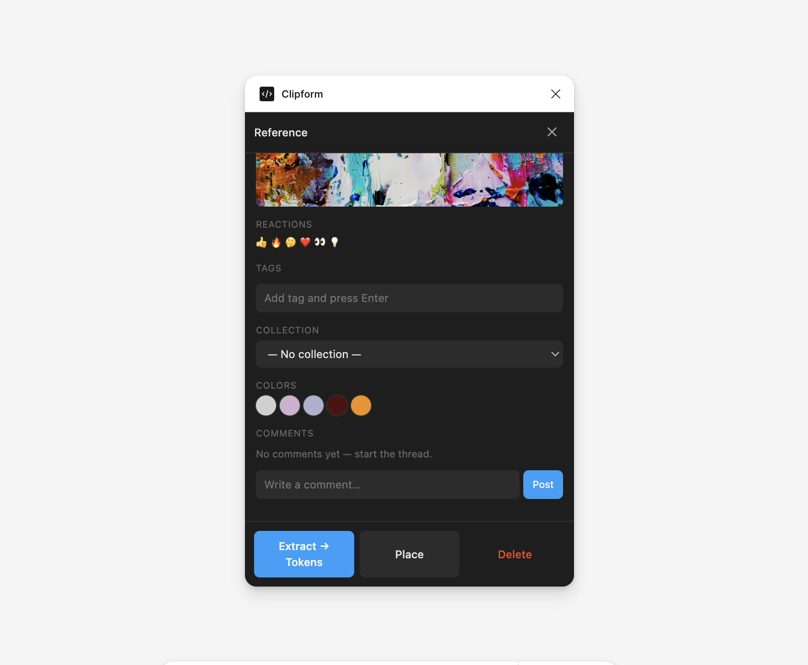
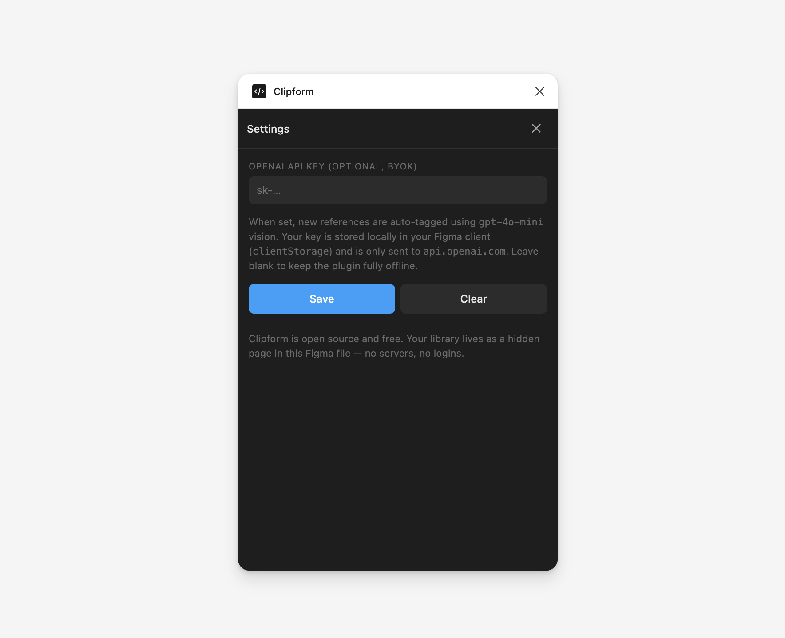

<div align="center">

# Clipform

**A Figma-native moodboard plugin. Free. Open. No login.**

[](LICENSE)


A reference library that lives **inside** your Figma file. Drop in images from anywhere, search them by what they look like, turn selections into moodboards with one click, and turn any reference into a working design system.

[Features](#features) · [Install](#install) · [Architecture](#architecture) · [Roadmap](#roadmap) · [License](#license)

<br />



</div>

---

## Why

Designers collect references constantly — and then lose them. Scattered tabs, scratch desktop folders, paste-into-Figma-once-and-forget. The references never make it to the people who'd actually use them next.

Clipform puts the library **where the work happens**. Your references travel with the file. Your teammates see them in real time. And because the library is just rectangles on a hidden Figma page, there are no servers to host, no logins to manage, no third party to trust.

## Features

### 🖼 Capture from anywhere

Paste, drop, drag from Finder, drag from a browser tab, or pull straight from the Figma canvas via the **`+`** button. Drags from the web also capture the source URL, so every reference remembers where it came from — click the **↗ host.com** chip to revisit the original.

### 🔮 Visual search, offline

A CLIP model loads once (~40 MB, cached locally in IndexedDB), then everything runs in your browser. Two superpowers:

- **Find similar** — click 🔍 on any reference to re-sort the grid by visual similarity
- **AI search** — type something like `dog` or `warm sunset architecture` and press **↵**. Semantic, not keyword. The model understands the meaning of the query.



### 🎨 7 layouts in one click

Pick multiple references, click **Arrange**, get a real auto-layout Figma frame. Pick from **Grid · Masonry · Hero + thumbs · Magazine · Filmstrip · Row · Polaroid**. Fully editable after — drag items between cells, change padding, the works.



### ⚙ Extract → design tokens

One click turns any reference into a starter design system:

| Created | What |
|---|---|
| **5 color variables + paint styles** | Palette sorted by luminance, accent picked by saturation |
| **8 spacing variables** | 4 → 64 (8pt scale) |
| **4 radius variables** | `sm`, `md`, `lg`, `pill` |
| **6 text styles** | Display → Caption, Inter at standard sizes |

All as **real Figma variables and styles** in your file. Apply them to anything by name — they're indistinguishable from tokens you'd hand-built.

### 👥 Team-native by default

Your library lives in the Figma file — that means it's multiplayer for free. Plus:

- Author attribution (`Added by Sara · 2m ago`)
- Reactions (👍 🔥 🤔 ❤️ 👀 💡)
- Comment threads on every reference
- Activity feed showing every add / react / comment
- Real-time auto-refresh when teammates make changes (via `figma.on('documentchange')`)



### Plus

- **Color palette** — 5 dominant colors extracted per save (quantized RGB histogram), filter by swatch
- **Tags + collections** — manual organization, BYOK AI auto-tagging via `gpt-4o-mini` vision
- **Lightbox** — full-screen preview with ← / → navigation
- **Save Figma selection** — turn any frame/group on canvas into a reference

### Optional: BYOK AI auto-tagging

Paste an OpenAI key in settings, and every new reference is tagged automatically. Key is stored in `figma.clientStorage` (per-user, never in the file). Leave it blank to keep the plugin fully offline.



## Install

The plugin is three files. No build step.

```bash
git clone https://github.com/YOUR_USERNAME/clipform.git
```

1. Open **Figma desktop** (browser-only Figma can't install dev plugins)
2. Menu → **Plugins → Development → Import plugin from manifest…**
3. Pick `manifest.json` from the cloned folder
4. Run via **Plugins → Development → Clipform**

First run downloads the CLIP model (~40 MB, ~30 s). Subsequent opens are instant — model is cached in IndexedDB.

## Architecture

Three files. Plain JS. No bundler, no transpiler.

```
clipform/
├── manifest.json    Plugin metadata, permissions, allowed domains
├── code.js          Sandbox — talks to the Figma document via figma.* API
└── ui.html          UI iframe — rendering, capture, CLIP, multiplayer
```

### How data is stored

Everything lives on a hidden page in your Figma file (`📌 Clipform Library`). Each reference is a rectangle with the image as a fill plus JSON metadata in `pluginData`:

```js
{
  kind: 'reference',
  imageHash: '...',        // Figma's deduplicated image cache
  collectionId: '...',
  tags: ['warm', 'editorial'],
  colors: ['#aabbcc', ...],
  embedding: 'base64...',  // 512-dim CLIP vector
  addedBy: { id, name },
  reactions: { '👍': [{ userId, userName, at }] },
  comments: [{ id, userId, userName, text, at }],
  sourceUrl: 'https://example.com/article',
  addedAt: 1234567890
}
```

The hidden page travels with the file. Teammates with file access automatically see the library, and Figma's multiplayer handles real-time sync for free.

### What goes over the network

Three things, all opt-in:

| Source | When | Why |
|---|---|---|
| `cdn.jsdelivr.net` | First plugin open | Transformers.js + CLIP model bytes (cached in IndexedDB after) |
| `images.weserv.nl` | Browser drag where source blocks CORS | Free image proxy fallback |
| `api.openai.com` | If you set a BYOK key | Auto-tag new refs with `gpt-4o-mini` vision |

Without an OpenAI key, the plugin is **100% offline** after the first model download.

### CLIP setup

The plugin loads both encoders explicitly:

```js
const visionModel = await CLIPVisionModelWithProjection.from_pretrained('Xenova/clip-vit-base-patch32', { quantized: true });
const textModel   = await CLIPTextModelWithProjection.from_pretrained('Xenova/clip-vit-base-patch32', { quantized: true });
```

Both produce 512-dim vectors in CLIP's joint embedding space — so text → image cosine similarity works. A custom IndexedDB-backed shim polyfills `self.caches` so model files persist across plugin opens (Figma's iframe doesn't expose the standard Cache API).

## Roadmap

The next release plans out in [`docs/v0.2.0.md`](docs/v0.2.0.md). Theme: *make a growing library effortless to manage*. Tier-1 features:

- [ ] Smart auto-collections — k-means on stored CLIP embeddings, with one-click create
- [ ] Bulk operations in the action bar (tag all / move to collection / delete)
- [ ] Sort + card-size controls in the top bar
- [ ] Combined filters — text query + color + collection layered together

Tier-2 (nice-to-have): crop-on-save, library-health panel, keyboard shortcuts. Browser extension and video support are out of scope and explained in the planning doc.

## Contributing

PRs welcome. See [CONTRIBUTING.md](CONTRIBUTING.md) for the file layout, conventions, and how to test locally.

## License

[MIT](LICENSE) — fork it, ship it, learn from it.
